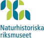

---
output:
  html_document:
    theme: null
    mathjax: null
---


```{r setup, include=FALSE}
knitr::opts_chunk$set(echo = TRUE)
library(swedishbirdrecoveries)

timespan <- range(birdrecoveries_swe$modified_date)
```



Detta är en applikation från Ringmärkningscentralen på Naturhistorika Riksmuseet som visar Återfynd av fåglar ringmärkta i Sverige, totalt `r  nrow(birdrecoveries_swe)` poster under tidsperioden 1911 till `r timespan[2]`.

Använd länkarna i övre högra hörnet för att läsa mer om ringmärkning i Sverige inklusive hur Du bör göra om Du hittat en ringmärkt fågel, samt om andra aktiviteter på Ringmärkningscentralen.


