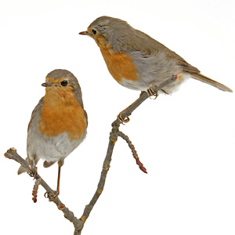

```{r, echo = FALSE}
knitr::opts_chunk$set(collapse = TRUE, comment = "#>")
```



# Intro to swedishbirdrecoveries

A programmatic interface to the Swedish Bird Recaptures database at the Swedish Museum for Natural History.

Swedish Bird Recoveries provide data and graphs for recovered birds which were originally marked with a ring in Sweden.

With this package you can work with the bird recoveries data and also create graphs and explore the dataset.

## Installation

You can get started by installing the development version from Github and loading it: 

```r
install.packages("devtools")
devtools::install_github("mskyttner/swedishbirdrecoveries")

library(swedishbirdrecoveries)
```

An example usage follows - a clustered map shows 100 birds recoveries from Falsterbo bird station. 

```{r, fig.show='hold', warning=FALSE, message=FALSE, fig.width=7}

library(leaflet)
library(swedishbirdrecoveries)

# use just 100 or so points here
birds <- 
  birdrecoveries_eng[1:100, ] %>%
  dplyr::rename(longitude = ringing_lon,
         latitude = ringing_lat)

# content in popup can be customized
popup_content <- #htmltools::htmlEscape(
  paste(sep = "<br/>",
    "<b><a href='http://nrm.se'>NRM</a></b>",
    "<b>Name:</b>", birds$name
)

map <- 
  leaflet(data = birds) %>% 
  # base groups
  addProviderTiles("OpenStreetMap.BlackAndWhite", group = "Gray") %>% 
  addProviderTiles("Stamen.TonerLite", group = "Black & White") %>%
#  addMarkers(~longitude, ~latitude, popup = ~as.character(dgr), group = "Individual") %>%
  addMarkers(~longitude, ~latitude, popup = popup_content,
             clusterOptions = markerClusterOptions(), group = "Clustered") %>%
  addLayersControl(
    baseGroups = c("Gray", "Black & White"),
#    overlayGroups = c("Individual", "Clustered"),
    options = layersControlOptions(collapsed = FALSE)
  )

map

```


More examples showing how to load the package and to retrieve data now follows.

## Latest bird recoveries

The first example shows the ten latest recoveries, arranged by recovery date and we also restrict the set of available column by selecting only three columns to display; the scientific name of the bird, the recovery date and a description of the determined cause for the recovery.

```{r, echo=TRUE, results='asis'}
# to load the package fairly silently we wrap the call to load the
# library in the suppressPackageStartupMessages function
suppressPackageStartupMessages(library(swedishbirdrecoveries))

# display data for the first ten rows and select three columns
library(dplyr)

birdrecoveries <- birdrecoveries_eng
df <- birdrecoveries %>% 
  arrange(desc(recovery_date)) %>%
  select(sciname, recovery_date, recovery_details) %>%
  head(10)

knitr::kable(df)
```

# What dimensions are available?

The available columns in the data provide dimensions that cover many of the 5W questions:

- WHAT - taxonomy (name, sciname) including gender/sex (ringing_sex_code, ringing_sex, recovery_sex_code, recovery_sex) and age (ringing_age_code ringing_age)
- WHEN - temporal/duration (ringing_date, recovery_date etc)
- WHERE - location/accurary - numerical and categorical (ringing_lot, ringing_lon, recovery_lat, recovery_lon, ringing_country, ringing_province, recovery_majorplace, recovery_minorplace etc)
- WHY/HOW - recovery event data (distance, direction, days, hours, recovery_code, recovery_details)
- WHO - source (source)

The help functions provide detailed metadata information for the bundled datasets. For example, you can get more details in the help for the `birdrecoveries_eng` dataset, which contains the following columns:

```{r, echo=TRUE, results='asis'}
colnames <- data_frame(colname = names(birdrecoveries_eng))
knitr::kable(colnames)
```

# Filter data using taxonomy

You may need to filter the data, given certain criteria related to the taxonomy. For example, you may want to remove or focus on certain taxa. 

Matching taxonomic names may be needed in order to make reasonable efforts towards avoiding to compare apples with oranges. 

A package called `taxize` can be used for this purpose. Here this package is used to link out to Encyclopedia of Life pages that are available for species in the dataset.

```{r, echo=TRUE, results='asis', warning=FALSE, message=FALSE}
#library(taxize)
#library(pander)

#eubon(query = species[1], searchMode = "scientificNameExact")

#res <- resolve(query = species, 
#  source = "GBIF Backbone Taxonomy", 
#  config = progress())


species <- birdrecoveries %>% select(sciname) %>% unique %>% .$sciname
# first_row <- function(x) eol_search(x) %>% head(1)
# res <- purrr::map_df(species, first_row)
# pages <- paste0("[", res$name, "](http://eol.org/pages/", res$pageid, ")\n")
# out <- data_frame(sciname = species, eol = pages)
# 
# pander(out)

```

## Usage demonstrating data extracts

> NB: If you want to do interactive data exploration in a web user interface, use: runShinyApp("birdrecoveries")

This section focuses on programmatic data extracts from the dataset bundled in the package.

TODO: Show how to search for bird recoveries by location (lat/lon), possibly with additional parameter settings, returning only 10 records, includes or excludes: 

```r
# ebirdgeo(lat = 42, lng = -76, max = 10, includeProvisional = TRUE, hotspot = TRUE)
```

TODO: Search using location IDs or by location ID and species name etc:

```r
# ebirdloc(locID = c('L99381','L99382'))

# ebirdloc(locID = 'L99381', species = 'larus delawarensis', max = 10, provisional = TRUE, hotspot=TRUE)
```

TODO: Search by region and species name and using additional parameters:

```r
# ebirdregion(region = 'US', species = 'Setophaga caerulescens')
# Note that we use `US-OH` to represent Ohio within the US. [See possible region values](https://confluence.cornell.edu/display/CLOISAPI/eBird-1.1-RegionCodeReference).
# ebirdregion(region = 'US-OH', max = 10, provisional = TRUE, hotspot = TRUE)
```

TODO: Search recent data by region and species name:

```r
#ebirdhotspot(locID = c('L99381','L99382'), species = 'larus delawarensis')
```

TODO: Obtain historical frequencies at a given hotspot or state or country, or time period, resuls can also be wide for making bar charts

```r
#ebirdfreq(loctype = 'hotspots', loc = 'L196159')
#ebirdfreq(loctype = 'hotspots', loc = 'L196159', long = FALSE)
#ebirdfreq(loctype = 'states', loc = 'CA-BC')
#ebirdfreq(loctype = 'counties', loc = 'CA-BC-GV')
#ebirdfreq(loctype = 'hotspots', loc = 'L196159', startyear = 2010,
          endyear = 2014, startmonth = 1, endmonth = 3)
```

TODO: Search for notable sightings at a given latitude and longitude

```r
#ebirdnotable(lat = 42, lng = -70)
```

TODO: Return a data.frame of all for the given parameter inputs

```r
# ebirdtaxonomy()
```

TODO: Check if a region is valid or get a data frame of regions or localities....
